# 🚀 Applications - YourMedia

Ce document centralise toute la documentation relative aux applications backend (Java) et frontend (React) du projet YourMedia.

## 📋 Table des matières

1. [Vue d'ensemble](#vue-densemble)
2. [Architecture](#architecture)
3. [Application Backend (Java)](#application-backend-java)
4. [Application Frontend (React)](#application-frontend-react)
5. [Déploiement](#déploiement)
6. [Tests](#tests)
7. [Maintenance](#maintenance)
8. [Performance](#performance)
9. [Sécurité](#sécurité)

## 🌟 Vue d'ensemble

YourMedia est une plateforme moderne de streaming vidéo composée de deux applications principales, conçues pour offrir une expérience utilisateur optimale et des performances élevées.

### 🎯 Objectifs

- Streaming vidéo haute performance
- Interface utilisateur réactive
- Architecture scalable
- Sécurité renforcée
- Disponibilité 99.9%
- Temps de réponse < 200ms

### 🔄 Flux de données


## 🏗 Architecture

### Composants principaux

| Composant | Technologie | Rôle | Scalabilité |
|-----------|-------------|------|-------------|
| Frontend | React | Interface utilisateur | Horizontale |
| Backend | Java/Spring | API REST | Horizontale |
| Base de données | MySQL | Stockage des données | Verticale |
| Stockage | S3 | Stockage des médias | Horizontale |
| Cache | Redis | Mise en cache | Horizontale |
| CDN | CloudFront | Distribution | Globale |
| Monitoring | CloudWatch | Métriques et logs | Horizontale |

### Communication

```mermaid
sequenceDiagram
    participant C as Client
    participant CDN as CloudFront
    participant F as Frontend
    participant B as Backend
    participant R as Redis
    participant DB as Database
    participant S3 as Storage

    C->>CDN: Requête HTTP
    CDN->>F: Assets statiques
    F->>B: Appel API
    B->>R: Check Cache
    alt Cache Hit
        R-->>B: Données en cache
    else Cache Miss
        B->>DB: Requête SQL
        DB-->>B: Résultat
        B->>R: Mise en cache
    end
    B->>S3: Upload/Download
    S3-->>B: Fichier
    B-->>F: Réponse API
    F-->>C: Rendu HTML
```



## 💻 Application Backend (Java)

### Structure du projet

```
app-java/
├── src/
│   ├── main/
│   │   ├── java/
│   │   │   └── com/
│   │   │       └── yourmedia/
│   │   │           └── backend/
│   │   │               ├── controller/
│   │   │               ├── service/
│   │   │               ├── model/
│   │   │               └── Application.java
│   │   └── resources/
│   │       └── application.yml
│   └── test/
└── pom.xml
```

### Configuration Maven
```xml
<?xml version="1.0" encoding="UTF-8"?>
<project xmlns="http://maven.apache.org/POM/4.0.0"
         xmlns:xsi="http://www.w3.org/2001/XMLSchema-instance"
         xsi:schemaLocation="http://maven.apache.org/POM/4.0.0 http://maven.apache.org/xsd/maven-4.0.0.xsd">
    <modelVersion>4.0.0</modelVersion>

    <groupId>com.yourmedia</groupId>
    <artifactId>backend</artifactId>
    <version>1.0.0</version>

    <parent>
        <groupId>org.springframework.boot</groupId>
        <artifactId>spring-boot-starter-parent</artifactId>
        <version>3.1.0</version>
    </parent>

    <properties>
        <java.version>17</java.version>
        <project.build.sourceEncoding>UTF-8</project.build.sourceEncoding>
    </properties>

    <dependencies>
        <dependency>
            <groupId>org.springframework.boot</groupId>
            <artifactId>spring-boot-starter-web</artifactId>
        </dependency>
        <dependency>
            <groupId>org.springframework.boot</groupId>
            <artifactId>spring-boot-starter-actuator</artifactId>
        </dependency>
        <dependency>
            <groupId>io.micrometer</groupId>
            <artifactId>micrometer-registry-prometheus</artifactId>
        </dependency>
        <dependency>
            <groupId>org.springframework.boot</groupId>
            <artifactId>spring-boot-starter-test</artifactId>
            <scope>test</scope>
        </dependency>
    </dependencies>

    <build>
        <plugins>
            <plugin>
                <groupId>org.springframework.boot</groupId>
                <artifactId>spring-boot-maven-plugin</artifactId>
            </plugin>
        </plugins>
    </build>
</project>
```

### Configuration Spring Boot
```yaml
# application.yml
server:
  port: 8080

spring:
  application:
    name: yourmedia-backend

management:
  endpoints:
    web:
      exposure:
        include: health,info,prometheus
  metrics:
    export:
      prometheus:
        enabled: true
```

### API REST

| Méthode | Endpoint | Description | Auth | Cache |
|---------|----------|-------------|------|-------|
| GET | /api/media | Liste des médias | ✅ | 1h |
| GET | /api/media/{id} | Détails média | ✅ | 1h |
| POST | /api/media | Création média | ✅ | ❌ |
| PUT | /api/media/{id} | Mise à jour | ✅ | ❌ |
| DELETE | /api/media/{id} | Suppression | ✅ | ❌ |
| POST | /api/media/upload | Upload fichier | ✅ | ❌ |
| GET | /api/media/download/{id} | Téléchargement | ✅ | 1h |
| GET | /api/media/search | Recherche | ✅ | 15m |

### Services

#### S3Service

```java
@Service
@Slf4j
public class S3Service {
    @Value("${aws.s3.bucket}")
    private String bucketName;

    @Value("${aws.s3.presigned-url.expiration}")
    private long presignedUrlExpiration;

    private final AmazonS3 s3Client;

    public S3Service() {
        this.s3Client = AmazonS3ClientBuilder.standard()
                .withRegion(Regions.EU_WEST_3)
                .withClientConfiguration(new ClientConfiguration()
                    .withMaxConnections(100)
                    .withConnectionTimeout(5000)
                    .withSocketTimeout(10000))
                .build();
    }

    public String uploadFile(MultipartFile file, String key) {
        try {
            ObjectMetadata metadata = new ObjectMetadata();
            metadata.setContentLength(file.getSize());
            metadata.setContentType(file.getContentType());
            metadata.setSSEAlgorithm(ObjectMetadata.AES_256_SERVER_SIDE_ENCRYPTION);

            s3Client.putObject(bucketName, key, file.getInputStream(), metadata);
            log.info("File uploaded successfully: {}", key);
            return s3Client.getUrl(bucketName, key).toString();
        } catch (IOException e) {
            log.error("Failed to upload file to S3: {}", key, e);
            throw new RuntimeException("Failed to upload file to S3", e);
        }
    }

    public String generatePresignedUrl(String key) {
        try {
            java.util.Date expiration = new java.util.Date();
            long expTimeMillis = expiration.getTime();
            expTimeMillis += presignedUrlExpiration * 1000;
            expiration.setTime(expTimeMillis);

            GeneratePresignedUrlRequest generatePresignedUrlRequest = 
                new GeneratePresignedUrlRequest(bucketName, key)
                    .withMethod(HttpMethod.GET)
                    .withExpiration(expiration);

            return s3Client.generatePresignedUrl(generatePresignedUrlRequest).toString();
        } catch (Exception e) {
            log.error("Failed to generate presigned URL for: {}", key, e);
            throw new RuntimeException("Failed to generate presigned URL", e);
        }
    }
}
```

## 🎨 Application Frontend (React)

### Structure du projet

```
app-react/
├── src/
│   ├── components/
│   ├── screens/
│   ├── services/
│   ├── utils/
│   └── App.js
├── app.json
├── package.json
└── Dockerfile
```

### Configuration Expo
```json
{
  "expo": {
    "name": "YourMedia",
    "slug": "yourmedia",
    "version": "1.0.0",
    "orientation": "portrait",
    "icon": "./assets/icon.png",
    "splash": {
      "image": "./assets/splash.png",
      "resizeMode": "contain",
      "backgroundColor": "#ffffff"
    },
    "updates": {
      "fallbackToCacheTimeout": 0
    },
    "assetBundlePatterns": [
      "**/*"
    ],
    "ios": {
      "supportsTablet": true
    },
    "android": {
      "adaptiveIcon": {
        "foregroundImage": "./assets/adaptive-icon.png",
        "backgroundColor": "#FFFFFF"
      }
    },
    "web": {
      "favicon": "./assets/favicon.png"
    }
  }
}
```

### Configuration Docker
```dockerfile
# Dockerfile
FROM node:16-alpine

WORKDIR /app

COPY package*.json ./
RUN npm install

COPY . .
RUN npm run build

# Install serve to run the application
RUN npm install -g serve

# Create a non-root user
RUN adduser -D appuser
USER appuser

# Set environment variables
ENV NODE_ENV=production
ENV PORT=8080

# Health check
HEALTHCHECK --interval=30s --timeout=30s --start-period=5s --retries=3 \
  CMD curl -f http://localhost:8080/ || exit 1

# Start the application
CMD ["serve", "-s", "build", "-l", "8080"]
```

## 🚀 Déploiement

### Backend
1. Build du WAR :
```bash
mvn clean package
```

2. Déploiement sur Tomcat :
```bash
./deploy-war.sh target/backend.war
```

### Frontend
1. Build de l'application :
```bash
npm run build
```

2. Déploiement sur l'instance de monitoring :
```bash
docker build -t yourmedia-frontend .
docker run -d -p 8080:8080 yourmedia-frontend
```

## 🧪 Tests

### Backend

```java
@SpringBootTest
class MediaServiceTest {
    @Autowired
    private MediaService mediaService;
    
    @MockBean
    private S3Service s3Service;
    
    @Test
    void testUploadMedia() {
        // Given
        MultipartFile file = mock(MultipartFile.class);
        when(file.getOriginalFilename()).thenReturn("test.mp4");
        when(file.getSize()).thenReturn(1024L);
        
        // When
        Media media = mediaService.uploadMedia(file);
        
        // Then
        assertNotNull(media);
        assertEquals("test.mp4", media.getFilename());
        verify(s3Service).uploadFile(any(), any());
    }
}
```

### Frontend

```javascript
import { render, screen, fireEvent } from '@testing-library/react';
import MediaList from './MediaList';

describe('MediaList', () => {
  const mockMedia = [
    { id: 1, title: 'Test Video 1' },
    { id: 2, title: 'Test Video 2' }
  ];

  it('renders media list correctly', () => {
    render(<MediaList media={mockMedia} onSelect={jest.fn()} />);
    
    expect(screen.getByText('Test Video 1')).toBeInTheDocument();
    expect(screen.getByText('Test Video 2')).toBeInTheDocument();
  });

  it('calls onSelect when media is clicked', () => {
    const onSelect = jest.fn();
    render(<MediaList media={mockMedia} onSelect={onSelect} />);
    
    fireEvent.click(screen.getByText('Test Video 1'));
    expect(onSelect).toHaveBeenCalledWith(mockMedia[0]);
  });
});
```

## 🔧 Maintenance

### Tâches quotidiennes

- [ ] Vérification des logs
- [ ] Monitoring des performances
- [ ] Sauvegardes de la base de données
- [ ] Nettoyage des fichiers temporaires

### Tâches hebdomadaires

- [ ] Analyse des métriques
- [ ] Revue des erreurs
- [ ] Mise à jour des dépendances
- [ ] Tests de performance

### Tâches mensuelles

- [ ] Audit de sécurité
- [ ] Optimisation des requêtes
- [ ] Nettoyage du cache
- [ ] Mise à jour de la documentation

## ⚡ Performance

### Métriques clés

| Métrique | Objectif | Monitoring |
|----------|----------|------------|
| Temps de réponse API | < 200ms | CloudWatch |
| Taux d'erreur | < 0.1% | CloudWatch |
| Utilisation CPU | < 70% | CloudWatch |
| Utilisation mémoire | < 80% | CloudWatch |
| Latence S3 | < 100ms | CloudWatch |

### Optimisations

1. **Backend**
   - Mise en cache Redis
   - Requêtes optimisées
   - Compression GZIP
   - Connection pooling

2. **Frontend**
   - Code splitting
   - Lazy loading
   - Image optimization
   - Service workers

## 🔒 Sécurité

### Mesures

1. **Backend**
   - Spring Security
   - JWT Authentication
   - Rate limiting
   - Input validation

2. **Frontend**
   - HTTPS
   - CSP
   - XSS protection
   - CSRF protection

## 📚 Ressources

- [Spring Boot Documentation](https://spring.io/projects/spring-boot)
- [React Documentation](https://reactjs.org/docs)
- [AWS SDK for Java](https://docs.aws.amazon.com/sdk-for-java)
- [Redis Documentation](https://redis.io/documentation)
- [Docker Documentation](https://docs.docker.com)
