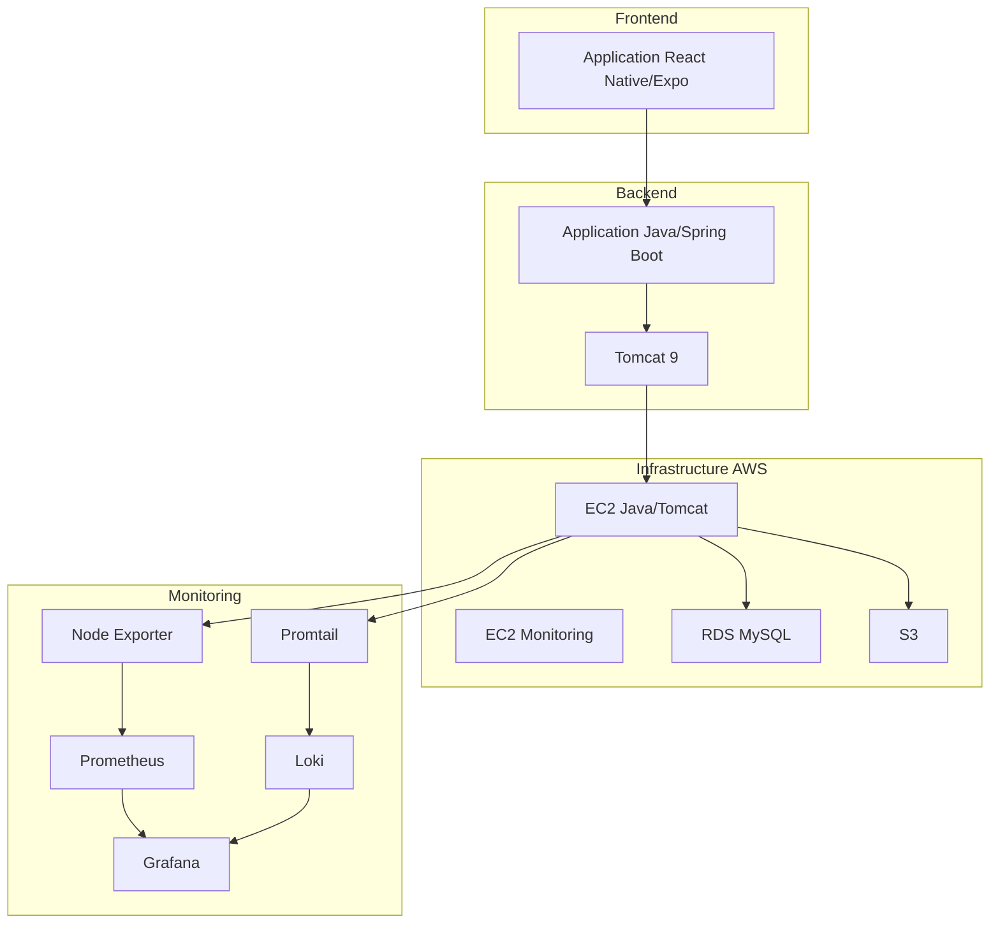

# Architecture YourMedia

## Table des matières
- [Vue d'ensemble](#vue-densemble)
- [Infrastructure AWS](#infrastructure-aws)
- [Applications](#applications)
- [Monitoring](#monitoring)
- [Sécurité](#sécurité)
- [Réseau](#réseau)
- [Stockage](#stockage)
- [Déploiement](#déploiement)

## Vue d'ensemble

YourMedia est une plateforme de streaming vidéo moderne construite avec une architecture microservices sur AWS. Le système est composé de deux applications principales et d'une infrastructure robuste pour le monitoring.

## Infrastructure AWS

### Composants principaux

| Composant | Type | Description |
|-----------|------|-------------|
| EC2 Java/Tomcat | Instance | t3.micro, Amazon Linux 2023 |
| EC2 Monitoring | Instance | t3.micro, Amazon Linux 2023 |
| RDS | Base de données | MySQL 8.0, db.t3.micro |
| S3 | Stockage | Bucket pour les médias |

### Configuration des instances

#### Instance Java/Tomcat
- AMI: Amazon Linux 2023
- Type: t3.micro
- Stockage: 8GB gp3
- Rôle IAM: Accès S3 en lecture seule
- Services: Java 17, Tomcat 9, Node Exporter, Promtail

#### Instance Monitoring
- AMI: Amazon Linux 2023
- Type: t3.micro
- Stockage: 8GB gp3
- Services: Docker, Prometheus, Grafana, Loki

## Applications

### Backend (Java/Spring Boot)
- Framework: Spring Boot 3.x
- Serveur: Tomcat 9
- Base de données: MySQL 8.0
- Monitoring: Micrometer, Actuator

### Frontend (React Native/Expo)
- Framework: React Native
- Plateforme: Expo
- API: REST
- Stockage: AsyncStorage

## Monitoring

### Composants
- Prometheus: Collecte des métriques
- Grafana: Visualisation
- Loki: Logs
- Node Exporter: Métriques système
- Promtail: Collecte des logs

### Métriques collectées
- Métriques système (CPU, mémoire, disque)
- Métriques Tomcat
- Métriques Spring Boot
- Logs d'application

## Sécurité

### Mesures en place
- Groupes de sécurité AWS
- IAM avec privilèges minimaux
- HTTPS pour les API
- Authentification JWT
- Chiffrement des données sensibles

### Accès
- SSH pour les instances EC2
- Ports ouverts minimaux
- Authentification à deux facteurs pour Grafana

## Réseau

### Architecture réseau
- VPC dédié
- Sous-réseaux publics et privés
- NAT Gateway pour l'accès Internet
- Internet Gateway pour les instances publiques

### Ports ouverts
- 22: SSH
- 80: HTTP
- 443: HTTPS
- 8080: Tomcat
- 3000: Grafana
- 9090: Prometheus
- 3100: Loki

## Stockage

### RDS MySQL
- Instance: db.t3.micro
- Stockage: 20GB gp2
- Sauvegardes automatiques
- Multi-AZ (optionnel)

### S3
- Bucket pour les médias
- Versioning activé
- Lifecycle policies
- Chiffrement SSE-S3

## Déploiement

### CI/CD
- GitHub Actions
- Déploiement automatique
- Tests automatisés
- Validation des pull requests

### Scripts d'automatisation
- Installation des dépendances
- Configuration des services
- Déploiement des applications
- Monitoring et maintenance

## Améliorations futures

1. **Haute disponibilité**
   - Multi-AZ pour RDS
   - Load balancing
   - Auto-scaling

2. **Monitoring**
   - Alerting avancé
   - Dashboards personnalisés
   - Métriques business

3. **Sécurité**
   - WAF
   - DDoS protection
   - Audit logging

4. **Performance**
   - CDN
   - Caching
   - Optimisation des requêtes
