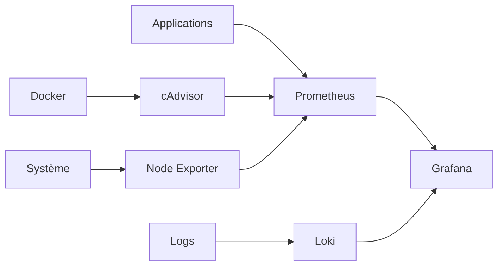
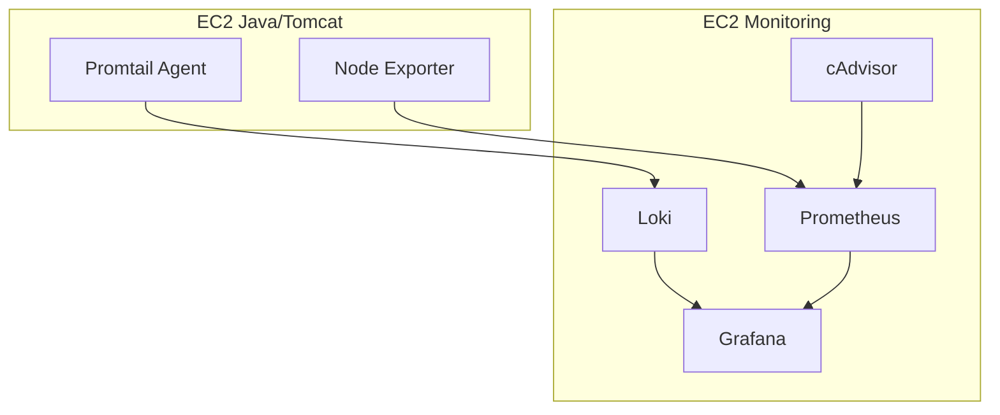

# 📊 Monitoring - YourMedia

## 📋 Table des matières

1. [Architecture](#architecture)
2. [Instance de monitoring](#instance-de-monitoring)
3. [Agents de monitoring](#agents-de-monitoring)
4. [Configuration des outils](#configuration-des-outils)
5. [Tableaux de bord](#tableaux-de-bord)
6. [Logs](#logs)
7. [Alertes](#alertes)
8. [Maintenance](#maintenance)

## 🌟 Vue d'ensemble

Le système de monitoring YourMedia est conçu pour fournir une visibilité complète sur l'infrastructure et les applications. Il combine des solutions open-source avec des services AWS natifs pour une couverture maximale.

### 🎯 Objectifs

- Monitoring en temps réel
- Détection proactive des problèmes
- Historique des performances
- Alertes automatisées
- Analyse des logs centralisée

## 🏢 Architecture

### Composants principaux

| Composant | Rôle | Port |
|-----------|------|------|
| Prometheus | Collecte des métriques | 9090 |
| Grafana | Visualisation | 3000 |
| Loki | Gestion des logs | 3100 |
| Promtail | Collecte des logs | 9080 |
| cAdvisor | Métriques Docker | 8080 |
| Node Exporter | Métriques système | 9100 |

### Flux de données



## 🔧 Composants

### Prometheus

```yaml
# Configuration Prometheus
global:
  scrape_interval: 15s
  evaluation_interval: 15s

scrape_configs:
  - job_name: 'prometheus'
    static_configs:
      - targets: ['localhost:9090']

  - job_name: 'node'
    static_configs:
      - targets: ['localhost:9100']

  - job_name: 'cadvisor'
    static_configs:
      - targets: ['localhost:8080']

  - job_name: 'tomcat'
    static_configs:
      - targets: ['localhost:8080']
```

### Grafana

#### Sources de données
```yaml
apiVersion: 1

datasources:
  - name: Prometheus
    type: prometheus
    access: proxy
    url: http://prometheus:9090
    isDefault: true

  - name: Loki
    type: loki
    access: proxy
    url: http://loki:3100
```

#### Dashboards principaux
- System Overview
- Java Application Metrics
- Docker Container Stats
- Log Analysis

### Loki

```yaml
auth_enabled: false

server:
  http_listen_port: 3100

ingester:
  lifecycler:
    address: 127.0.0.1
    ring:
      kvstore:
        store: inmemory
      replication_factor: 1
    final_sleep: 0s
  chunk_idle_period: 5m
  chunk_retain_period: 30s

schema_config:
  configs:
    - from: 2020-05-15
      store: boltdb
      object_store: filesystem
      schema: v11
      index:
        prefix: index_
        period: 24h

storage_config:
  boltdb:
    directory: /tmp/loki/index
  filesystem:
    directory: /tmp/loki/chunks

limits_config:
  enforce_metric_name: false
  reject_old_samples: true
  reject_old_samples_max_age: 168h
```

### Promtail

```yaml
server:
  http_listen_port: 9080
  grpc_listen_port: 0

positions:
  filename: /tmp/positions.yaml

clients:
  - url: http://loki:3100/loki/api/v1/push

scrape_configs:
  - job_name: system
    static_configs:
      - targets:
          - localhost
        labels:
          job: varlogs
          __path__: /var/log/*log

  - job_name: tomcat
    static_configs:
      - targets:
          - localhost
        labels:
          job: tomcat
          __path__: /var/log/tomcat/*.log

  - job_name: docker
    static_configs:
      - targets:
          - localhost
        labels:
          job: docker
          __path__: /var/log/docker/*.log
```

### Configuration de Promtail pour Java/Tomcat

#### Prérequis

##### Serveur d'application
- Instance EC2 avec Java/Tomcat installé
- Accès SSH au serveur
- Permissions sudo
- Connexion réseau vers le serveur Loki

##### Serveur de monitoring
- Instance EC2 avec Loki installé
- Port 3100 accessible
- Stockage suffisant pour les logs

#### Installation de Promtail

1. **Préparation du système**
   ```bash
   # Mettre à jour le système
   sudo dnf update -y
   
   # Installer les dépendances
   sudo dnf install -y wget unzip
   ```

2. **Téléchargement et installation**
   ```bash
   # Créer le répertoire d'installation
   sudo mkdir -p /opt/promtail
   cd /opt/promtail
   
   # Télécharger Promtail
   sudo wget https://github.com/grafana/loki/releases/download/v2.9.0/promtail-linux-amd64.zip
   
   # Décompresser
   sudo unzip promtail-linux-amd64.zip
   
   # Rendre exécutable
   sudo chmod +x promtail-linux-amd64
   sudo mv promtail-linux-amd64 /usr/local/bin/promtail
   ```

3. **Configuration de Promtail**
   ```bash
   # Créer le répertoire de configuration
   sudo mkdir -p /etc/promtail
   
   # Créer le fichier de configuration
   sudo tee /etc/promtail/config.yml << 'EOF'
   server:
     http_listen_port: 9080
     grpc_listen_port: 0
   
   positions:
     filename: /tmp/positions.yaml
   
   clients:
     - url: http://loki:3100/loki/api/v1/push
   
   scrape_configs:
     - job_name: tomcat
       static_configs:
         - targets:
             - localhost
           labels:
             job: tomcat
             __path__: /var/log/tomcat/*.log
   
     - job_name: system
       static_configs:
         - targets:
             - localhost
           labels:
             job: varlogs
             __path__: /var/log/*.log
   EOF
   ```

4. **Configuration du service systemd**
   ```bash
   # Créer le service systemd
   sudo tee /etc/systemd/system/promtail.service << 'EOF'
   [Unit]
   Description=Promtail service
   After=network.target
   
   [Service]
   Type=simple
   User=root
   ExecStart=/usr/local/bin/promtail -config.file /etc/promtail/config.yml
   Restart=always
   
   [Install]
   WantedBy=multi-user.target
   EOF
   
   # Recharger systemd
   sudo systemctl daemon-reload
   
   # Démarrer et activer Promtail
   sudo systemctl start promtail
   sudo systemctl enable promtail
   ```

5. **Vérification de l'installation**
   ```bash
   # Vérifier le statut du service
   sudo systemctl status promtail
   
   # Vérifier les logs
   sudo journalctl -u promtail -f
   ```

#### Configuration des logs Tomcat

1. **Configuration de logging.properties**
   ```properties
   # /etc/tomcat/logging.properties
   handlers = 1catalina.org.apache.juli.FileHandler, 2localhost.org.apache.juli.FileHandler, java.util.logging.ConsoleHandler
   
   .handlers = 1catalina.org.apache.juli.FileHandler, java.util.logging.ConsoleHandler
   
   1catalina.org.apache.juli.FileHandler.level = INFO
   1catalina.org.apache.juli.FileHandler.directory = ${catalina.base}/logs
   1catalina.org.apache.juli.FileHandler.prefix = catalina.
   1catalina.org.apache.juli.FileHandler.rotatable = true
   1catalina.org.apache.juli.FileHandler.maxDays = 7
   ```

2. **Configuration des permissions**
   ```bash
   # Donner les permissions nécessaires à Promtail
   sudo usermod -aG tomcat promtail
   sudo chmod 755 /var/log/tomcat
   ```

#### Vérification et dépannage

1. **Vérifier la collecte des logs**
   ```bash
   # Vérifier les logs Promtail
   sudo journalctl -u promtail -f
   
   # Vérifier l'accès aux fichiers de log
   sudo -u promtail ls -l /var/log/tomcat/
   ```

2. **Problèmes courants**
   - Erreur de permission : Vérifier les permissions des fichiers de log
   - Erreur de connexion : Vérifier la connectivité vers Loki
   - Logs manquants : Vérifier les chemins dans la configuration

## 📈 Tableaux de bord

### 1. Vue d'ensemble système

| Métrique | Description | Seuil d'alerte |
|----------|-------------|----------------|
| CPU | Utilisation CPU | > 80% |
| Mémoire | Utilisation RAM | > 85% |
| Disque | Espace libre | < 20% |
| Réseau | Trafic | > 100MB/s |

### 2. Métriques Java/Tomcat

| Métrique | Description | Seuil d'alerte |
|----------|-------------|----------------|
| Heap | Utilisation mémoire JVM | > 80% |
| Threads | Nombre de threads | > 200 |
| GC | Temps de GC | > 1s |
| Requêtes | Latence HTTP | > 500ms |

### 3. Métriques Docker

| Métrique | Description | Seuil d'alerte |
|----------|-------------|----------------|
| CPU | Utilisation CPU conteneur | > 70% |
| Mémoire | Utilisation RAM conteneur | > 80% |
| Restarts | Nombre de redémarrages | > 3/h |
| Uptime | Temps de fonctionnement | < 1h |

## 📝 Logs

### Configuration des logs

#### Tomcat
```properties
# logging.properties
handlers = 1catalina.org.apache.juli.FileHandler, 2localhost.org.apache.juli.FileHandler, 3manager.org.apache.juli.FileHandler, 4host-manager.org.apache.juli.FileHandler, java.util.logging.ConsoleHandler

.handlers = 1catalina.org.apache.juli.FileHandler, java.util.logging.ConsoleHandler

1catalina.org.apache.juli.FileHandler.level = INFO
1catalina.org.apache.juli.FileHandler.directory = ${catalina.base}/logs
1catalina.org.apache.juli.FileHandler.prefix = catalina.
1catalina.org.apache.juli.FileHandler.rotatable = true
1catalina.org.apache.juli.FileHandler.maxDays = 7
```

#### Application
```properties
# application.properties
logging.level.root=INFO
logging.level.com.yourmedia=DEBUG
logging.pattern.console=%d{yyyy-MM-dd HH:mm:ss} [%thread] %-5level %logger{36} - %msg%n
logging.file.name=/var/log/tomcat/application.log
logging.file.max-size=10MB
logging.file.max-history=7
```

## ⚠️ Alertes

### Configuration des alertes

```yaml
groups:
  - name: system
    rules:
      - alert: HighCPUUsage
        expr: 100 - (avg by(instance) (irate(node_cpu_seconds_total{mode="idle"}[5m])) * 100) > 80
        for: 5m
        labels:
          severity: warning
        annotations:
          summary: "High CPU usage detected"
          description: "CPU usage is above 80% for 5 minutes"

      - alert: HighMemoryUsage
        expr: (node_memory_MemTotal_bytes - node_memory_MemAvailable_bytes) / node_memory_MemTotal_bytes * 100 > 85
        for: 5m
        labels:
          severity: warning
        annotations:
          summary: "High memory usage detected"
          description: "Memory usage is above 85% for 5 minutes"
```

### Notifications

- Email via SMTP
- Slack webhook
- PagerDuty integration

## 🔧 Maintenance

### Tâches quotidiennes

1. Vérification des alertes
2. Analyse des logs
3. Nettoyage des anciens logs
4. Vérification des backups

### Tâches hebdomadaires

1. Mise à jour des dashboards
2. Révision des seuils d'alerte
3. Analyse des tendances
4. Optimisation des requêtes

### Tâches mensuelles

1. Mise à jour des composants
2. Révision de la rétention
3. Audit des accès
4. Rapport de performance

## 📚 Ressources

- [Documentation Prometheus](https://prometheus.io/docs)
- [Documentation Grafana](https://grafana.com/docs)
- [Documentation Loki](https://grafana.com/docs/loki/latest)
- [Documentation cAdvisor](https://github.com/google/cadvisor)

## Architecture de monitoring

### Vue d'ensemble


### Composants
| Composant | Type | Localisation | Rôle |
|-----------|------|--------------|------|
| Promtail | Agent | EC2 Java/Tomcat | Collecte des logs |
| Node Exporter | Agent | EC2 Java/Tomcat | Métriques système |
| Prometheus | Serveur | EC2 Monitoring | Collecte des métriques |
| Grafana | Interface | EC2 Monitoring | Visualisation |
| Loki | Serveur | EC2 Monitoring | Stockage des logs |
| cAdvisor | Agent | EC2 Monitoring | Métriques conteneurs |

## Instance de monitoring

### Conteneurs actifs
```bash
docker ps
```

| Conteneur | Port | Description |
|-----------|------|-------------|
| prometheus | 9090 | Collecte des métriques |
| grafana | 3000 | Interface de visualisation |
| loki | 3100 | Stockage des logs |
| cadvisor | 8080 | Métriques conteneurs |

### Configuration Docker Compose
```yaml
version: '3'
services:
  prometheus:
    image: prom/prometheus:latest
    volumes:
      - ./config/prometheus:/etc/prometheus
    ports:
      - "9090:9090"
    command:
      - '--config.file=/etc/prometheus/prometheus.yml'

  grafana:
    image: grafana/grafana:latest
    volumes:
      - ./config/grafana:/etc/grafana
    ports:
      - "3000:3000"
    environment:
      - GF_SECURITY_ADMIN_PASSWORD=${GRAFANA_ADMIN_PASSWORD}

  loki:
    image: grafana/loki:latest
    volumes:
      - ./config/loki:/etc/loki
    ports:
      - "3100:3100"
    command:
      - '-config.file=/etc/loki/loki-config.yml'

  cadvisor:
    image: gcr.io/cadvisor/cadvisor:latest
    volumes:
      - /:/rootfs:ro
      - /var/run:/var/run:ro
      - /sys:/sys:ro
      - /var/lib/docker/:/var/lib/docker:ro
    ports:
      - "8080:8080"
```

## Agents de monitoring

### Promtail (EC2 Java/Tomcat)

Installation et configuration :
```bash
# Installation
wget -q -O /tmp/promtail.tar.gz "https://github.com/grafana/loki/releases/download/v2.9.0/promtail-linux-amd64.zip"
unzip /tmp/promtail.tar.gz -d /tmp
sudo mv /tmp/promtail-linux-amd64 /usr/local/bin/promtail

# Configuration du service
sudo tee /etc/systemd/system/promtail.service << EOF
[Unit]
Description=Promtail service
After=network.target

[Service]
Type=simple
ExecStart=/usr/local/bin/promtail -config.file /etc/promtail/config.yml

[Install]
WantedBy=multi-user.target
EOF

# Configuration Promtail
sudo tee /etc/promtail/config.yml << EOF
server:
  http_listen_port: 9080
  grpc_listen_port: 0

positions:
  filename: /tmp/positions.yaml

clients:
  - url: http://${LOKI_HOST}:3100/loki/api/v1/push

scrape_configs:
  - job_name: system
    static_configs:
      - targets:
          - localhost
        labels:
          job: varlogs
          __path__: /var/log/*log

    pipeline_stages:
      - regex:
          expression: '^(?P<timestamp>\d{4}-\d{2}-\d{2} \d{2}:\d{2}:\d{2}) (?P<level>\w+) (?P<message>.*)$'
      - timestamp:
          source: timestamp
          format: "2006-01-02 15:04:05"
      - labels:
          level:
EOF

# Démarrage du service
sudo systemctl daemon-reload
sudo systemctl start promtail
sudo systemctl enable promtail
```

### Node Exporter (EC2 Java/Tomcat)

Installation et configuration :
```bash
# Installation
NODE_EXPORTER_VERSION="1.7.0"
wget -q -O /tmp/node_exporter.tar.gz "https://github.com/prometheus/node_exporter/releases/download/v${NODE_EXPORTER_VERSION}/node_exporter-${NODE_EXPORTER_VERSION}.linux-amd64.tar.gz"
sudo tar xzf /tmp/node_exporter.tar.gz -C /tmp
sudo mv /tmp/node_exporter-${NODE_EXPORTER_VERSION}.linux-amd64/node_exporter /usr/local/bin/

# Configuration du service
sudo tee /etc/systemd/system/node_exporter.service << EOF
[Unit]
Description=Node Exporter
After=network.target

[Service]
User=node_exporter
Group=node_exporter
Type=simple
ExecStart=/usr/local/bin/node_exporter

[Install]
WantedBy=multi-user.target
EOF

# Démarrage du service
sudo systemctl daemon-reload
sudo systemctl start node_exporter
sudo systemctl enable node_exporter
```

## Configuration des outils

### Prometheus
```yaml
global:
  scrape_interval: 15s
  evaluation_interval: 15s

scrape_configs:
  - job_name: 'node'
    static_configs:
      - targets: ['${EC2_APP_IP}:9100']

  - job_name: 'cadvisor'
    static_configs:
      - targets: ['localhost:8080']
```

### Grafana
```yaml
apiVersion: 1

datasources:
  - name: Prometheus
    type: prometheus
    access: proxy
    url: http://prometheus:9090
    isDefault: true

  - name: Loki
    type: loki
    access: proxy
    url: http://loki:3100
```

### Loki
```yaml
auth_enabled: false

server:
  http_listen_port: 3100

ingester:
  lifecycler:
    address: 127.0.0.1
    ring:
      kvstore:
        store: inmemory
      replication_factor: 1
    final_sleep: 0s
  chunk_idle_period: 5m
  chunk_retain_period: 30s

schema_config:
  configs:
    - from: 2020-05-15
      store: boltdb
      object_store: filesystem
      schema: v11
      index:
        prefix: index_
        period: 168h

storage_config:
  boltdb:
    directory: /tmp/loki/index

  filesystem:
    directory: /tmp/loki/chunks

limits_config:
  enforce_metric_name: false
  reject_old_samples: true
  reject_old_samples_max_age: 168h
```

## 📚 Ressources

- [Documentation Prometheus](https://prometheus.io/docs)
- [Documentation Grafana](https://grafana.com/docs)
- [Documentation Loki](https://grafana.com/docs/loki/latest)
- [Documentation cAdvisor](https://github.com/google/cadvisor)

## 📚 Ressources

- [Documentation Prometheus](https://prometheus.io/docs)
- [Documentation Grafana](https://grafana.com/docs)
- [Documentation Loki](https://grafana.com/docs/loki/latest)
- [Documentation cAdvisor](https://github.com/google/cadvisor)
