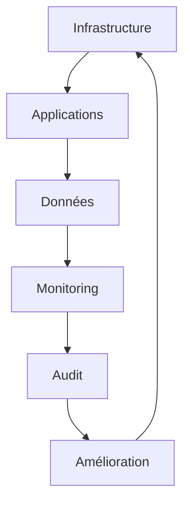

# 🔒 Sécurité - YourMedia

Ce document détaille les mesures de sécurité mises en place pour protéger l'infrastructure, les applications et les données de YourMedia.

## 📋 Table des matières

1. [Vue d'ensemble](#vue-densemble)
2. [Infrastructure](#infrastructure)
3. [Applications](#applications)
4. [Données](#données)
5. [Accès](#accès)
6. [Monitoring](#monitoring)
7. [Audit](#audit)
8. [Conformité](#conformité)
9. [Incidents](#incidents)
10. [Formation](#formation)

## 🌟 Vue d'ensemble

La sécurité est une priorité absolue pour YourMedia. Notre approche de sécurité est basée sur le modèle de défense en profondeur, avec des mesures de protection à chaque niveau.

### 🎯 Objectifs de sécurité

- Protection des données sensibles
- Disponibilité des services
- Intégrité des systèmes
- Conformité réglementaire
- Détection des menaces
- Réponse aux incidents

### 🔄 Flux de sécurité



## 🏢 Infrastructure

### EC2

#### Configuration de base

| Paramètre | Valeur | Description | Risque |
|-----------|--------|-------------|---------|
| Mises à jour | Automatiques | Security patches quotidiens | Faible |
| Accès SSH | IPs autorisées | Via Security Groups | Moyen |
| IAM | Privilèges minimaux | Rôles dédiés par service | Faible |
| Security Groups | Moindre privilège | Ports et protocoles limités | Faible |
| Monitoring | CloudWatch | Métriques et logs | Faible |

#### Instance Java/Tomcat

```hcl
resource "aws_instance" "app_server" {
  ami           = data.aws_ami.amazon_linux_2023.id
  instance_type = "t3.medium"
  
  vpc_security_group_ids = [aws_security_group.app.id]
  iam_instance_profile   = aws_iam_instance_profile.app.name
  
  root_block_device {
    encrypted = true
    kms_key_id = aws_kms_key.ebs.arn
  }
  
  metadata_options {
    http_endpoint = "enabled"
    http_tokens   = "required"
  }
  
  tags = {
    Name = "yourmedia-app"
    Environment = var.environment
    SecurityLevel = "high"
  }
}
```

### 🔒 Security Groups

```hcl
resource "aws_security_group" "app" {
  name = "yourmedia-app-sg"
  vpc_id = aws_vpc.main.id

  ingress {
    from_port   = 22
    to_port     = 22
    protocol    = "tcp"
    cidr_blocks = [var.ssh_ip]
    description = "SSH access from bastion"
  }

  ingress {
    from_port   = 8080
    to_port     = 8080
    protocol    = "tcp"
    cidr_blocks = ["0.0.0.0/0"]
    description = "Application access"
  }

  egress {
    from_port   = 0
    to_port     = 0
    protocol    = "-1"
    cidr_blocks = ["0.0.0.0/0"]
    description = "Allow all outbound"
  }

  tags = {
    Name = "yourmedia-app-sg"
    Environment = var.environment
  }
}
```

### 🐳 Docker

#### Configuration sécurisée

```yaml
version: '3.8'

services:
  app:
    image: yourmedia/app:latest
    user: "1000:1000"
    cap_drop:
      - ALL
    cap_add:
      - NET_BIND_SERVICE
    read_only: true
    tmpfs:
      - /tmp
    volumes:
      - app_data:/data:ro
    networks:
      - app_network
    deploy:
      resources:
        limits:
          cpus: '1'
          memory: 1G
    security_opt:
      - no-new-privileges:true
      - seccomp:unconfined
    healthcheck:
      test: ["CMD", "curl", "-f", "http://localhost:8080/health"]
      interval: 30s
      timeout: 10s
      retries: 3
    logging:
      driver: "json-file"
      options:
        max-size: "10m"
        max-file: "3"
```

## 💻 Applications

### Backend Java

#### Spring Security

```java
@Configuration
@EnableWebSecurity
public class SecurityConfig extends WebSecurityConfigurerAdapter {
    
    @Override
    protected void configure(HttpSecurity http) throws Exception {
        http
            .csrf().disable()
            .sessionManagement()
                .sessionCreationPolicy(SessionCreationPolicy.STATELESS)
            .and()
            .authorizeRequests()
                .antMatchers("/api/public/**").permitAll()
                .anyRequest().authenticated()
            .and()
            .addFilterBefore(jwtAuthenticationFilter(),
                UsernamePasswordAuthenticationFilter.class)
            .headers()
                .contentSecurityPolicy("default-src 'self'")
                .and()
                .frameOptions().deny()
                .xssProtection().block(true)
                .and()
            .requiresChannel()
                .anyRequest().requiresSecure();
    }
}
```

### Frontend React

#### Configuration de sécurité

```javascript
// Content Security Policy
const csp = {
  'default-src': ["'self'"],
  'script-src': ["'self'", "'unsafe-inline'"],
  'style-src': ["'self'", "'unsafe-inline'"],
  'img-src': ["'self'", 'data:', 'https:'],
  'connect-src': ["'self'", 'https://api.yourmedia.com'],
  'frame-ancestors': ["'none'"],
  'form-action': ["'self'"],
  'base-uri': ["'self'"],
  'object-src': ["'none'"]
};

// Headers de sécurité
app.use(helmet({
  contentSecurityPolicy: {
    directives: csp
  },
  hsts: {
    maxAge: 31536000,
    includeSubDomains: true,
    preload: true
  },
  noSniff: true,
  xssFilter: true,
  frameguard: {
    action: 'deny'
  }
}));
```

## 💾 Données

### Chiffrement

#### Au repos

| Service | Méthode | Clé | Rotation |
|---------|---------|-----|----------|
| S3 | SSE-S3 | AWS KMS | 90 jours |
| RDS | AES-256 | AWS KMS | 90 jours |
| EBS | AES-256 | AWS KMS | 90 jours |
| Secrets | AES-256 | AWS KMS | 30 jours |

#### En transit

```nginx
# Configuration TLS
ssl_protocols TLSv1.2 TLSv1.3;
ssl_ciphers ECDHE-ECDSA-AES128-GCM-SHA256:ECDHE-RSA-AES128-GCM-SHA256:ECDHE-ECDSA-AES256-GCM-SHA384:ECDHE-RSA-AES256-GCM-SHA384:ECDHE-ECDSA-CHACHA20-POLY1305:ECDHE-RSA-CHACHA20-POLY1305:DHE-RSA-AES128-GCM-SHA256:DHE-RSA-AES256-GCM-SHA384;
ssl_prefer_server_ciphers off;
ssl_session_timeout 1d;
ssl_session_cache shared:SSL:50m;
ssl_session_tickets off;
ssl_stapling on;
ssl_stapling_verify on;
add_header Strict-Transport-Security "max-age=31536000; includeSubDomains; preload" always;
add_header X-Frame-Options DENY;
add_header X-Content-Type-Options nosniff;
add_header X-XSS-Protection "1; mode=block";
```

## 🔑 Accès

### IAM

#### Rôles et politiques

```json
{
  "Version": "2012-10-17",
  "Statement": [
    {
      "Effect": "Allow",
      "Action": [
        "s3:GetObject",
        "s3:PutObject"
      ],
      "Resource": "arn:aws:s3:::yourmedia-*/*",
      "Condition": {
        "StringEquals": {
          "aws:PrincipalTag/Environment": "${var.environment}"
        },
        "IpAddress": {
          "aws:SourceIp": [
            "10.0.0.0/16"
          ]
        }
      }
    }
  ]
}
```

### 🔐 Secrets Management

```hcl
resource "aws_secretsmanager_secret" "db" {
  name = "yourmedia/db/${var.environment}"
  description = "Database credentials for ${var.environment}"
  
  tags = {
    Environment = var.environment
    Service = "database"
    Rotation = "30d"
  }
}

resource "aws_secretsmanager_secret_rotation" "db" {
  secret_id = aws_secretsmanager_secret.db.id
  rotation_lambda_arn = aws_lambda_function.rotation.arn
  
  rotation_rules {
    automatically_after_days = 30
  }
}
```

## 📊 Monitoring

### Alertes de sécurité

```yaml
groups:
  - name: security
    rules:
      - alert: HighCPUUsage
        expr: cpu_usage > 80
        for: 5m
        labels:
          severity: warning
        annotations:
          summary: High CPU usage detected
          description: CPU usage is above 80% for 5 minutes

      - alert: UnauthorizedAccess
        expr: failed_login_attempts > 5
        for: 1m
        labels:
          severity: critical
        annotations:
          summary: Multiple failed login attempts
          description: More than 5 failed login attempts in 1 minute
```

## 📝 Audit

### Logs

| Service | Type | Rétention | Alertes |
|---------|------|-----------|---------|
| CloudTrail | API | 90 jours | Oui |
| VPC Flow | Network | 30 jours | Oui |
| RDS | Database | 30 jours | Oui |
| Application | App | 15 jours | Oui |

### Rapports

- Audit quotidien des accès
- Revue hebdomadaire des logs
- Analyse mensuelle des incidents
- Rapport trimestriel de sécurité

## 📋 Conformité

### Standards

- ISO 27001
- GDPR
- SOC 2
- PCI DSS

### Contrôles

1. **Accès**
   - Authentification forte
   - Rotation des clés
   - Gestion des sessions

2. **Données**
   - Chiffrement
   - Sauvegarde
   - Rétention

3. **Systèmes**
   - Mises à jour
   - Monitoring
   - Tests de sécurité

## 🚨 Incidents

### Procédure

1. **Détection**
   - Monitoring
   - Alertes
   - Rapports

2. **Réponse**
   - Isolation
   - Investigation
   - Correction

3. **Récupération**
   - Restauration
   - Tests
   - Documentation

### Contacts

| Rôle | Contact | Téléphone |
|------|---------|-----------|
| Security Lead | security@yourmedia.com | +33 1 23 45 67 89 |
| On-call | oncall@yourmedia.com | +33 1 23 45 67 90 |
| Management | management@yourmedia.com | +33 1 23 45 67 91 |

## 👨‍🏫 Formation

### Modules

1. **Sécurité de base**
   - Bonnes pratiques
   - Gestion des mots de passe
   - Phishing

2. **Sécurité avancée**
   - Architecture
   - Monitoring
   - Incident response

3. **Conformité**
   - Standards
   - Procédures
   - Documentation

## 📚 Ressources

- [AWS Security Best Practices](https://aws.amazon.com/security)
- [OWASP Top 10](https://owasp.org/www-project-top-ten)
- [NIST Cybersecurity Framework](https://www.nist.gov/cyberframework)
- [ISO 27001](https://www.iso.org/isoiec-27001-information-security)
- [GDPR](https://gdpr.eu)
