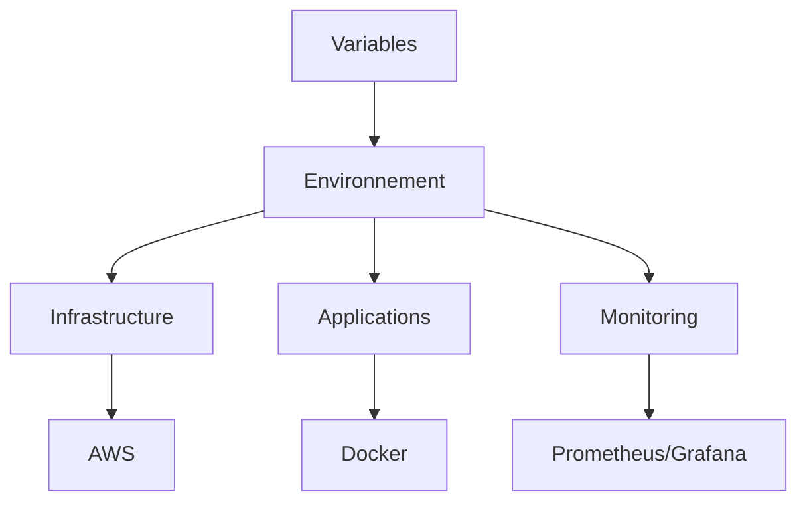

# 🔧 Variables - YourMedia

Ce document liste toutes les variables utilisées dans le projet YourMedia, organisées par catégorie et environnement.

## 📋 Table des matières

1. [Vue d'ensemble](#vue-densemble)
2. [Environnements](#environnements)
3. [Variables AWS](#variables-aws)
4. [Variables Docker](#variables-docker)
5. [Variables Monitoring](#variables-monitoring)
6. [Variables GitHub Actions](#variables-github-actions)
7. [Variables Terraform](#variables-terraform)
8. [Bonnes pratiques](#bonnes-pratiques)

## 🌟 Vue d'ensemble

YourMedia utilise différentes variables pour configurer l'infrastructure, les applications et les outils de monitoring. Ces variables sont organisées par catégorie et peuvent avoir des valeurs différentes selon l'environnement.

### 🎯 Objectifs

- Centralisation des configurations
- Sécurité des données sensibles
- Flexibilité des déploiements
- Maintenance simplifiée

### 🔄 Flux de configuration

## 🌍 Environnements

### Variables communes

| Variable | Description | Format |
|----------|-------------|--------|
| `ENVIRONMENT` | Environnement de déploiement | `dev/staging/prod` |
| `PROJECT_NAME` | Nom du projet | `yourmedia` |
| `REGION` | Région de déploiement | `eu-west-3` |

### Configuration par environnement

| Variable | Dev | Staging | Prod |
|----------|-----|---------|------|
| `INSTANCE_TYPE` | t2.micro | t2.small | t2.medium |
| `DB_INSTANCE` | db.t3.micro | db.t3.small | db.t3.medium |
| `REPLICA_COUNT` | 1 | 2 | 3 |

## ☁️ Variables AWS

### EC2

| Variable | Description | Valeur par défaut | Sécurisée |
|----------|-------------|-------------------|-----------|
| `aws_region` | Région AWS | `eu-west-3` | Non |
| `instance_type` | Type d'instance EC2 | `t2.micro` | Non |
| `ami_id` | ID de l'AMI Amazon Linux 2023 | `ami-0c55b159cbfafe1f0` | Non |
| `volume_size` | Taille du volume EBS (Go) | `8` | Non |
| `volume_type` | Type de volume EBS | `gp2` | Non |
| `availability_zone` | Zone de disponibilité | `eu-west-3a` | Non |
| `key_name` | Nom de la clé SSH | - | Oui |

### RDS

| Variable | Description | Valeur par défaut | Sécurisée |
|----------|-------------|-------------------|-----------|
| `db_instance_class` | Type d'instance RDS | `db.t3.micro` | Non |
| `db_engine` | Moteur de base de données | `mysql` | Non |
| `db_engine_version` | Version du moteur | `8.0` | Non |
| `db_allocated_storage` | Stockage alloué (Go) | `20` | Non |
| `db_name` | Nom de la base de données | `yourmedia` | Non |
| `db_username` | Nom d'utilisateur | `admin` | Oui |
| `db_password` | Mot de passe | - | Oui |

### S3

| Variable | Description | Valeur par défaut | Sécurisée |
|----------|-------------|-------------------|-----------|
| `s3_bucket_name` | Nom du bucket S3 | `yourmedia-artifacts` | Non |
| `s3_versioning` | Activation du versioning | `true` | Non |
| `s3_encryption` | Type de chiffrement | `AES256` | Non |
| `s3_lifecycle_days` | Jours de rétention | `30` | Non |
| `s3_access_key` | Clé d'accès S3 | - | Oui |
| `s3_secret_key` | Clé secrète S3 | - | Oui |

## 🐳 Variables Docker

### Java/Tomcat

| Variable | Description | Valeur par défaut | Sécurisée |
|----------|-------------|-------------------|-----------|
| `tomcat_version` | Version de Tomcat | `9.0.65` | Non |
| `java_version` | Version de Java | `11` | Non |
| `tomcat_user` | Utilisateur Tomcat | `tomcat` | Non |
| `tomcat_group` | Groupe Tomcat | `tomcat` | Non |
| `tomcat_port` | Port Tomcat | `8080` | Non |
| `tomcat_ajp_port` | Port AJP | `8009` | Non |
| `tomcat_admin_password` | Mot de passe admin | - | Oui |

### Monitoring

| Variable | Description | Valeur par défaut | Sécurisée |
|----------|-------------|-------------------|-----------|
| `prometheus_version` | Version de Prometheus | `2.45.0` | Non |
| `grafana_version` | Version de Grafana | `10.0.0` | Non |
| `loki_version` | Version de Loki | `2.8.0` | Non |
| `promtail_version` | Version de Promtail | `2.8.0` | Non |
| `node_exporter_version` | Version de Node Exporter | `1.6.1` | Non |

## 📊 Variables Monitoring

### Prometheus

| Variable | Description | Valeur par défaut | Sécurisée |
|----------|-------------|-------------------|-----------|
| `prometheus_retention_time` | Période de rétention | `15d` | Non |
| `prometheus_scrape_interval` | Intervalle de scraping | `15s` | Non |
| `prometheus_evaluation_interval` | Intervalle d'évaluation | `15s` | Non |
| `prometheus_admin_password` | Mot de passe admin | - | Oui |

### Grafana

| Variable | Description | Valeur par défaut | Sécurisée |
|----------|-------------|-------------------|-----------|
| `grafana_admin_user` | Utilisateur admin | `admin` | Non |
| `grafana_admin_password` | Mot de passe admin | - | Oui |
| `grafana_port` | Port Grafana | `3000` | Non |
| `grafana_secret_key` | Clé secrète | - | Oui |

### Loki

| Variable | Description | Valeur par défaut | Sécurisée |
|----------|-------------|-------------------|-----------|
| `loki_retention_period` | Période de rétention | `168h` | Non |
| `loki_port` | Port Loki | `3100` | Non |
| `loki_admin_password` | Mot de passe admin | - | Oui |

### Promtail

| Variable | Description | Valeur par défaut | Sécurisée |
|----------|-------------|-------------------|-----------|
| `promtail_port` | Port Promtail | `9080` | Non |
| `promtail_positions_file` | Fichier de positions | `/var/lib/promtail/positions.yaml` | Non |

## 🔄 Variables GitHub Actions

### Déploiement

| Variable | Description | Valeur par défaut | Sécurisée |
|----------|-------------|-------------------|-----------|
| `AWS_ACCESS_KEY_ID` | Clé d'accès AWS | - | Oui |
| `AWS_SECRET_ACCESS_KEY` | Clé secrète AWS | - | Oui |
| `AWS_REGION` | Région AWS | `eu-west-3` | Non |
| `EC2_HOST` | Host EC2 | - | Oui |
| `EC2_USERNAME` | Utilisateur EC2 | `ec2-user` | Non |
| `SSH_PRIVATE_KEY` | Clé SSH privée | - | Oui |

### Build

| Variable | Description | Valeur par défaut | Sécurisée |
|----------|-------------|-------------------|-----------|
| `JAVA_VERSION` | Version de Java | `11` | Non |
| `NODE_VERSION` | Version de Node.js | `18` | Non |
| `MAVEN_OPTS` | Options Maven | `-Xmx2048m` | Non |
| `NPM_TOKEN` | Token NPM | - | Oui |

## 🏗 Variables Terraform

### Général

| Variable | Description | Valeur par défaut | Sécurisée |
|----------|-------------|-------------------|-----------|
| `environment` | Environnement | `dev` | Non |
| `project_name` | Nom du projet | `yourmedia` | Non |
| `tags` | Tags AWS | `{}` | Non |

### Réseau

| Variable | Description | Valeur par défaut | Sécurisée |
|----------|-------------|-------------------|-----------|
| `vpc_cidr` | CIDR du VPC | `10.0.0.0/16` | Non |
| `public_subnet_cidr` | CIDR du subnet public | `10.0.1.0/24` | Non |
| `private_subnet_cidr` | CIDR du subnet privé | `10.0.2.0/24` | Non |

## 🔒 Bonnes pratiques

### Sécurité

1. **Variables sensibles**
   - Stocker dans AWS Secrets Manager
   - Utiliser GitHub Secrets
   - Ne jamais commiter dans le code

2. **Rotation des secrets**
   - Mots de passe : 90 jours
   - Clés API : 180 jours
   - Certificats : 365 jours

3. **Validation**
   - Vérifier les formats
   - Valider les plages de valeurs
   - Tester les configurations

### Maintenance

1. **Documentation**
   - Tenir à jour les valeurs par défaut
   - Documenter les changements
   - Maintenir les exemples

2. **Audit**
   - Vérifier les accès
   - Réviser les permissions
   - Analyser les logs

## 📚 Ressources

- [AWS Variables Documentation](https://docs.aws.amazon.com/cli/latest/userguide/cli-configure-envvars.html)
- [Docker Environment Variables](https://docs.docker.com/compose/environment-variables)
- [GitHub Actions Variables](https://docs.github.com/en/actions/learn-github-actions/variables)
- [Terraform Variables](https://www.terraform.io/language/values/variables)
- [AWS Secrets Manager](https://docs.aws.amazon.com/secretsmanager)
- [GitHub Secrets](https://docs.github.com/en/actions/security-guides/encrypted-secrets)
