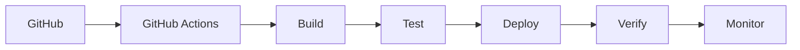

# Workflows CI/CD - YourMedia

## Table des matières
- [Vue d'ensemble](#vue-densemble)
- [Workflows](#workflows)
- [Configuration](#configuration)
- [Sécurité](#sécurité)

## Vue d'ensemble



## Workflows

### Backend CI/CD
```yaml
name: Backend CI/CD

on:
  push:
    branches: [ main ]
    paths:
      - 'app-java/**'
  pull_request:
    branches: [ main ]
    paths:
      - 'app-java/**'

jobs:
  build-and-test:
    runs-on: ubuntu-latest
    
    steps:
    - uses: actions/checkout@v3
    
    - name: Set up JDK 17
      uses: actions/setup-java@v3
      with:
        java-version: '17'
        distribution: 'temurin'
        
    - name: Build with Maven
      run: |
        cd app-java
        mvn clean package
        
    - name: Run tests
      run: |
        cd app-java
        mvn test
        
    - name: Upload WAR artifact
      uses: actions/upload-artifact@v3
      with:
        name: backend-war
        path: app-java/target/*.war
        
  deploy:
    needs: build-and-test
    runs-on: ubuntu-latest
    if: github.ref == 'refs/heads/main'
    
    steps:
    - uses: actions/checkout@v3
    
    - name: Download WAR artifact
      uses: actions/download-artifact@v3
      with:
        name: backend-war
        
    - name: Deploy to EC2
      uses: appleboy/ssh-action@master
      with:
        host: ${{ secrets.EC2_HOST }}
        username: ${{ secrets.EC2_USERNAME }}
        key: ${{ secrets.EC2_SSH_KEY }}
        script: |
          cd /opt/yourmedia
          ./deploy-war.sh backend.war
```

### Frontend CI/CD
```yaml
name: Frontend CI/CD

on:
  push:
    branches: [ main ]
    paths:
      - 'app-react/**'
  pull_request:
    branches: [ main ]
    paths:
      - 'app-react/**'

jobs:
  build-and-test:
    runs-on: ubuntu-latest
    
    steps:
    - uses: actions/checkout@v3
    
    - name: Set up Node.js
      uses: actions/setup-node@v3
      with:
        node-version: '16'
        
    - name: Install dependencies
      run: |
        cd app-react
        npm install
        
    - name: Run tests
      run: |
        cd app-react
        npm test
        
    - name: Build
      run: |
        cd app-react
        npm run build
        
    - name: Upload build artifact
      uses: actions/upload-artifact@v3
      with:
        name: frontend-build
        path: app-react/build/
        
  deploy:
    needs: build-and-test
    runs-on: ubuntu-latest
    if: github.ref == 'refs/heads/main'
    
    steps:
    - uses: actions/checkout@v3
    
    - name: Download build artifact
      uses: actions/download-artifact@v3
      with:
        name: frontend-build
        
    - name: Deploy to S3
      uses: aws-actions/configure-aws-credentials@v1
      with:
        aws-access-key-id: ${{ secrets.AWS_ACCESS_KEY_ID }}
        aws-secret-access-key: ${{ secrets.AWS_SECRET_ACCESS_KEY }}
        aws-region: eu-west-3
        
    - name: Deploy to S3
      run: |
        aws s3 sync build/ s3://${{ secrets.S3_BUCKET }}/
```

### Infrastructure CI/CD
```yaml
name: Infrastructure CI/CD

on:
  push:
    branches: [ main ]
    paths:
      - 'infrastructure/**'
  pull_request:
    branches: [ main ]
    paths:
      - 'infrastructure/**'

jobs:
  terraform:
    runs-on: ubuntu-latest
    
    steps:
    - uses: actions/checkout@v3
    
    - name: Setup Terraform
      uses: hashicorp/setup-terraform@v2
      with:
        terraform_version: 1.5.0
        
    - name: Terraform Init
      run: |
        cd infrastructure
        terraform init
        
    - name: Terraform Plan
      run: |
        cd infrastructure
        terraform plan
      env:
        TF_VAR_aws_access_key: ${{ secrets.AWS_ACCESS_KEY_ID }}
        TF_VAR_aws_secret_key: ${{ secrets.AWS_SECRET_ACCESS_KEY }}
        
    - name: Terraform Apply
      if: github.ref == 'refs/heads/main'
      run: |
        cd infrastructure
        terraform apply -auto-approve
      env:
        TF_VAR_aws_access_key: ${{ secrets.AWS_ACCESS_KEY_ID }}
        TF_VAR_aws_secret_key: ${{ secrets.AWS_SECRET_ACCESS_KEY }}
```

## Configuration

### Secrets GitHub
| Secret | Description |
|--------|-------------|
| AWS_ACCESS_KEY_ID | Clé d'accès AWS |
| AWS_SECRET_ACCESS_KEY | Clé secrète AWS |
| EC2_HOST | IP de l'instance EC2 |
| EC2_USERNAME | Nom d'utilisateur EC2 |
| EC2_SSH_KEY | Clé SSH privée |
| S3_BUCKET | Nom du bucket S3 |

### Variables d'environnement
| Variable | Valeur | Description |
|----------|--------|-------------|
| NODE_VERSION | 16 | Version de Node.js |
| JAVA_VERSION | 17 | Version de Java |
| TERRAFORM_VERSION | 1.5.0 | Version de Terraform |

## Sécurité

### Bonnes pratiques
1. Utilisation des secrets GitHub pour les informations sensibles
2. Validation des pull requests avant le déploiement
3. Tests automatisés avant le déploiement
4. Déploiement progressif

### Validation des pull requests
1. Tests unitaires
2. Tests d'intégration
3. Analyse de code statique
4. Vérification des dépendances

### Déploiement
1. Build des artefacts
2. Tests automatisés
3. Déploiement sur l'environnement de staging
4. Tests de validation
5. Déploiement en production

### Monitoring
1. Vérification des métriques après déploiement
2. Alertes en cas d'erreur
3. Logs de déploiement
4. Rollback automatique en cas d'échec
